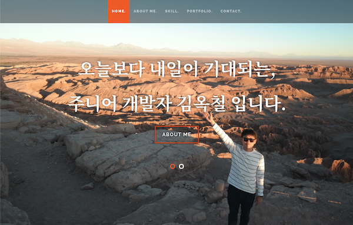

# Developer React Portfolio site

> It's a portfolio site for developer Okchul Kim.

## Portfolio Introduction

[link](https://jolly-pare-994dc2.netlify.com)

This site is made using *React.js*. 
You can easily connect via click [**Here**](https://jolly-pare-994dc2.netlify.com)

## Portfolio stack

*Client-side*
* React.js
* [Styleshout CSS Template](http://styleshout.com)

*Hosting*
* Netlify